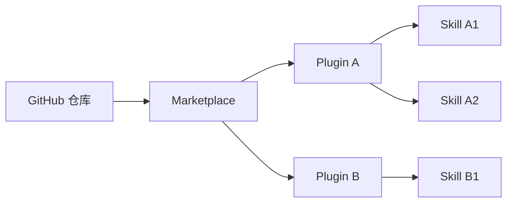
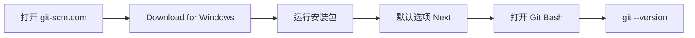
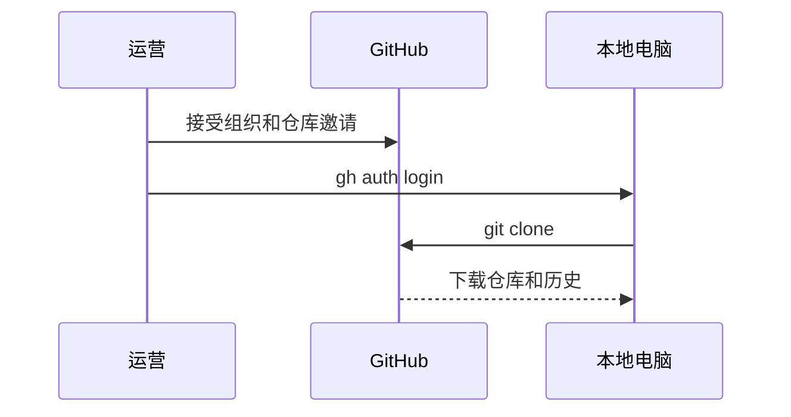
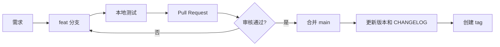

# Codex 业务插件市场

这是 `ai-plan-go/amazon-plugins` 团队插件仓库。仓库已经清空原有示例插件，后续由业务团队自行维护。本文假设读者不熟悉 Git、GitHub 或 Codex，按顺序完成即可。

> 重要：本仓库只保存插件源码和配置，不保存密码、Cookie、API Key、客户数据、运行结果或截图。任何密钥泄露后都应立即在对应平台撤销并重新生成。

## 当前可用插件

| Plugin | 版本 | 用途 |
| --- | --- | --- |
| `amazon-asin-monitor` | 1.2.0 | 美国、英国、德国、澳洲和法国站 ASIN 前台巡检，包含 Buy Box、价格促销、父子体关系、排名、截图和 Excel 报告。 |

## 一、先理解三个概念

| 概念 | 作用 | 本仓库对应位置 |
| --- | --- | --- |
| Git 仓库 | 保存所有历史版本，支持多人协作 | `https://github.com/ai-plan-go/amazon-plugins` |
| Marketplace | 给 Codex 读取的插件目录，列出可安装插件 | `.agents/plugins/marketplace.json` |
| Plugin | 一个可安装的功能包，可包含一个或多个 Skill、脚本和测试 | `plugins/<plugin-name>/` |
| Skill | Codex 执行任务时读取的业务说明和规则 | `plugins/<plugin-name>/skills/<skill-name>/SKILL.md` |



一个仓库使用一个 Marketplace；一个 Marketplace 可以登记多个 Plugin；一个 Plugin 可以包含多个 Skill。

## 二、第一次准备电脑（Windows）

### 1. 安装 Git

1. 打开 [Git for Windows](https://git-scm.com/download/win)。
2. 下载并运行安装包。
3. 保持默认选项，持续点击 **Next**，最后点击 **Install**。
4. 在开始菜单打开 **Git Bash**，输入：

```bash
git --version
```

看到类似 `git version 2.x.x` 即安装成功。



### 2. 注册 GitHub

1. 打开 [GitHub 注册页](https://github.com/signup)。
2. 使用公司邮箱注册，完成邮箱验证和安全验证。
3. 用户名建议使用真实姓名拼音或公司统一格式。
4. 开启双因素认证：**Settings → Password and authentication → Two-factor authentication**。

### 3. 让管理员添加账号

把 GitHub 用户名和注册邮箱发给管理员。管理员需要完成两步：

1. 在组织 `ai-plan-go` 的 **People** 页面邀请该 GitHub 用户名。
2. 在仓库 **Settings → Collaborators and teams** 中，将用户加入对应团队或直接授权仓库。

建议普通运营使用 **Write** 权限；只有仓库负责人使用 **Maintain/Admin**。不要多人共享管理员账号。收到邀请后，通过 GitHub 通知或邮件接受。若看不到仓库，先确认邀请已接受、登录账号正确，再让管理员检查组织 SSO 和仓库权限。

## 三、第一次登录和下载仓库

### 1. 配置提交身份

在 Git Bash 执行一次：

```bash
git config --global user.name "你的姓名"
git config --global user.email "你的公司邮箱"
```

邮箱最好与 GitHub 已验证邮箱一致。

### 2. 登录 GitHub

推荐安装 [GitHub CLI](https://cli.github.com/)，然后执行：

```bash
gh auth login
```

选择 `GitHub.com` → `HTTPS` → `Login with a web browser`，按提示复制一次性验证码并在浏览器授权。

如果公司电脑不能安装 `gh`，可在 GitHub 的 **Settings → Developer settings → Fine-grained tokens** 创建 Token。克隆或推送时使用用户名和 Token；Token 只显示一次，不能写入脚本或提交到仓库。

### 3. 克隆仓库

```bash
mkdir -p ~/work
cd ~/work
git clone https://github.com/ai-plan-go/amazon-plugins.git
cd amazon-plugins
git status
```

看到 `On branch main` 且工作区干净，就准备好了。



## 四、创建新的 Plugin 和 Skill

### 1. 推荐目录结构

```text
amazon-plugins/
├─ .agents/plugins/marketplace.json
├─ plugins/
│  └─ product-report/
│     ├─ .codex-plugin/plugin.json
│     ├─ skills/
│     │  └─ product-report/
│     │     ├─ SKILL.md
│     │     ├─ agents/openai.yaml
│     │     └─ references/
│     ├─ scripts/
│     ├─ tests/
│     └─ README.md
└─ CHANGELOG.md
```

名称统一使用小写英文和短横线。`agents/openai.yaml`、`references/`、`scripts/` 可按需添加，`plugin.json` 和每个 Skill 的 `SKILL.md` 必须存在。

### 2. 创建 Plugin 元数据

`plugins/product-report/.codex-plugin/plugin.json` 示例：

```json
{
  "name": "product-report",
  "version": "0.1.0",
  "description": "生成商品经营报告",
  "author": { "name": "ai-plan-go", "url": "https://github.com/ai-plan-go" },
  "repository": "https://github.com/ai-plan-go/amazon-plugins",
  "skills": "./skills/",
  "interface": {
    "displayName": "Product Report",
    "shortDescription": "生成商品经营报告"
  }
}
```

### 3. 编写 `SKILL.md`

建议按“触发条件 → 输入 → 步骤 → 输出 → 异常 → 验收标准”编写。固定计算、批量读取和文件生成优先放到脚本中；`SKILL.md` 负责告诉 Codex 何时调用脚本、如何检查结果。修改业务规则时，也要同步更新测试样例。

## 五、登记到 Marketplace

编辑 `.agents/plugins/marketplace.json`，在 `plugins` 数组中新增：

```json
{
  "name": "product-report",
  "source": { "source": "local", "path": "./plugins/product-report" },
  "policy": { "installation": "AVAILABLE", "authentication": "ON_INSTALL" },
  "category": "Productivity"
}
```

`name` 必须与 `plugin.json` 一致，`path` 从仓库根目录开始。检查 JSON：

```bash
python -m json.tool .agents/plugins/marketplace.json > /dev/null
python -m json.tool plugins/product-report/.codex-plugin/plugin.json > /dev/null
```

Windows PowerShell 可去掉最后的 `> /dev/null`，直接查看格式化结果。

## 六、版本管理规则

使用三段式版本号 `MAJOR.MINOR.PATCH`：

- `PATCH`：修复错误或文案，不改变使用方式，例如 `0.1.0` → `0.1.1`。
- `MINOR`：新增向后兼容能力或新 Skill，例如 `0.1.1` → `0.2.0`。
- `MAJOR`：删除或重命名入口、改变输入输出，例如 `0.2.0` → `1.0.0`。

每次修改 Plugin 都要更新其 `plugin.json` 的 `version` 和根目录 `CHANGELOG.md`。Marketplace 不单独保存版本号。建议每个 Plugin 使用独立 tag：

```bash
git tag product-report-v0.1.0
git push origin product-report-v0.1.0
```

## 七、提交、审核和发布

不要直接在 `main` 上改文件。每项需求创建分支：

```bash
git switch main
git pull --ff-only origin main
git switch -c feat/product-report
# 修改文件后
git status
git add .
git diff --cached
git commit -m "feat: add product report plugin"
git push -u origin feat/product-report
```

然后在 GitHub 创建 Pull Request，至少检查：

1. JSON 可解析，路径大小写正确。
2. `SKILL.md`、脚本和测试完整。
3. 没有 Token、密码、Cookie、客户数据和本地绝对路径。
4. 版本号和 `CHANGELOG.md` 已更新。
5. 新机器按 README 能安装和运行。

审核通过后合并到 `main`，再创建版本 tag。



## 八、Codex 添加 Marketplace 和安装 Plugin

在 Codex 终端中执行：

```powershell
codex plugin marketplace add https://github.com/ai-plan-go/amazon-plugins
codex plugin marketplace list
codex plugin list
codex plugin add product-report@amazon-plugins
```

如果 Codex 提供图形化插件市场，也可以在 Marketplace 管理界面添加仓库 URL，刷新后选择插件安装。命令行更方便复制和排错。

安装后新建任务，使用 Skill 名称或自然语言触发：

```text
$product-report 读取本次上传的商品表，生成经营报告，并列出缺失字段。
```

用以下命令确认安装状态：

```powershell
codex plugin list
codex plugin marketplace list
```

建议首次使用时让 Codex 先说明将使用哪个 Plugin/Skill，再执行一个最小样例。

## 九、更新 Marketplace 和已安装 Plugin

业务发布新版本后，使用者先刷新 Marketplace，再更新 Plugin：

```powershell
codex plugin marketplace update amazon-plugins
codex plugin update product-report@amazon-plugins
```

不同 Codex 版本的子命令可能变化。若提示没有 `plugin update`，先运行 `codex plugin --help`；也可以卸载后重新安装：

```powershell
codex plugin remove product-report@amazon-plugins
codex plugin add product-report@amazon-plugins
```

修改 GitHub 源码不会自动替换本机已安装缓存。升级后应检查插件版本、`SKILL.md` 入口，并执行一个最小业务样例。

## 十、常见问题

### 看不到仓库

确认已接受组织邀请、登录账号正确，并让管理员检查组织成员资格、SSO 和仓库团队权限。

### `git push` 被拒绝

先确认当前分支和登录状态。如果提示权限不足，检查 Write 权限；如果分支落后，先拉取并解决差异。不要使用他人的 Token。

### Marketplace 能添加但插件安装失败

检查 `marketplace.json` 路径、插件目录名、`.codex-plugin/plugin.json` 是否存在，并用 `python -m json.tool` 检查 JSON。

### Codex 没有触发 Skill

确认插件已安装、Skill 目录内有 `SKILL.md`，并在新任务中明确使用 `$skill-name`；同时检查 `plugin.json` 的 `skills` 是否为 `./skills/`。

### 如何撤回问题版本

暂停发布并提交修复版本，不要重写已被别人使用的 tag。若涉及密钥，立即撤销密钥，再清理 Git 历史并轮换凭证。

## 十一、管理员日常清单

- 每个 Plugin 至少有一个可运行 Skill、README、版本号和测试。
- 所有变更通过 Pull Request，`main` 设为受保护分支。
- 每个版本写入 `CHANGELOG.md`，重要版本打 tag。
- 定期检查组织成员和仓库权限，员工离职立即移除。
- 不提交运行数据、账号凭证和机器本地路径。
- 新增 Plugin 后，用干净电脑验证“添加 Marketplace → 安装 → 最小任务 → 更新”全流程。
